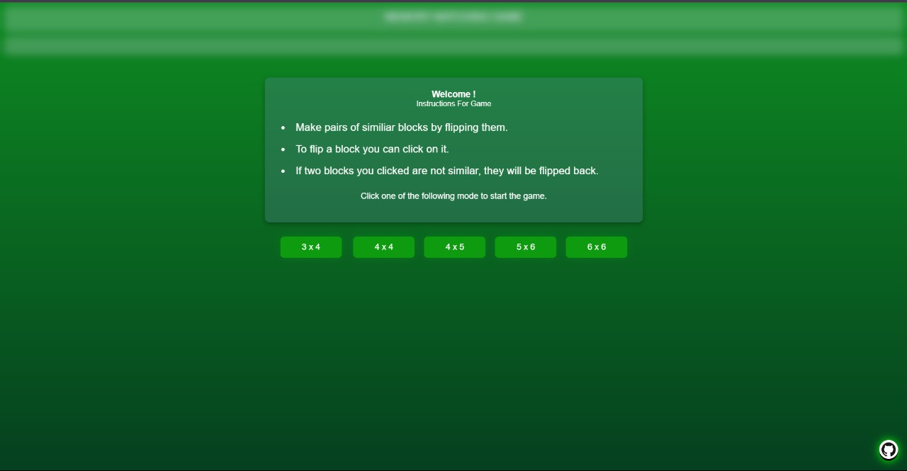

# Memory matching game

# Designed and Developed by Sanket Rathod

This project is made using HTML,CSS &amp; JavaScript.

It's a simple online memory matching game, which contains various levels.
 
Here are some snapshots from game.

  